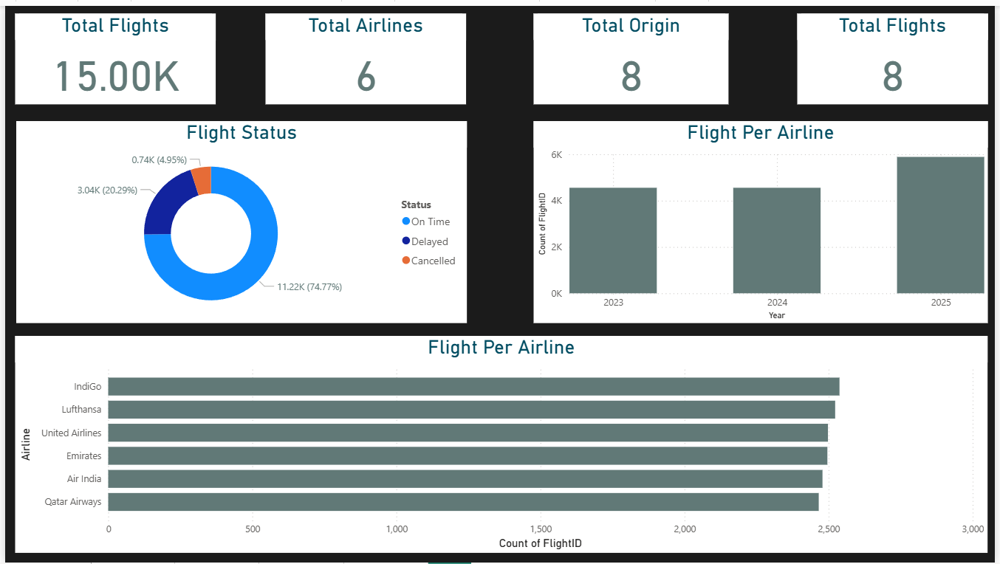
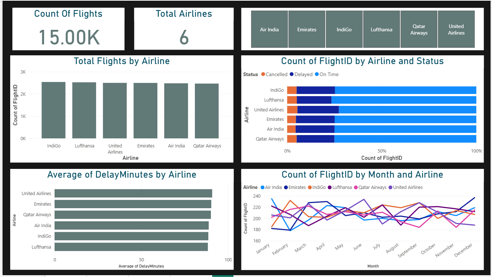
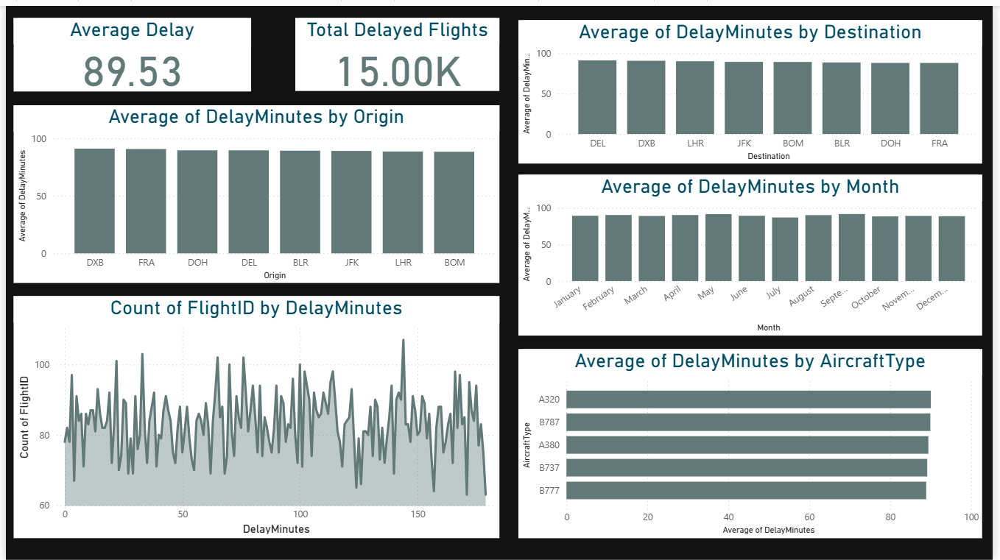

# Airline-Analytics-PowerBi-Project
This is an exciting project I had prepared to push my limits in Power BI. 

[]&nbsp;

## Project Overview
The Airline Analytics Power BI Project provides a comprehensive analysis of airline operations from 2023 to 2025, covering flight performance, delays, routes, and revenue insights.
This project aims to help airline analysts, operations teams, and management understand trends, identify inefficiencies, and make data-driven decisions.

The dataset includes key fields such as Flight ID, Airline, Date, Origin, Destination, Status, Aircraft Type, Delay Minutes, and more—allowing detailed analysis across multiple dimensions.

This project contains 5 well-structured dashboards, each focusing on a specific business area: airline performance, delay analytics, route efficiency, airport activity, and financial outcomes. All dashboards are designed with a consistent theme, clean layout, and interaction filters to enable smooth exploration.

The insights discovered through these dashboards help highlight:

Best-performing airlines

Major delay contributors

Busiest routes and airports

Flight status distribution

Seasonal travel patterns

Passenger and revenue trends

Flight punctuality & operational gaps

This project showcases strong skills in data visualization, report design, BI storytelling, and business analysis—delivering clear, actionable insights for the aviation industry.

## Key Features of the Dashboard

✅ 1. Multi-Dashboard Structure

The project includes five dedicated dashboards, each focusing on a specific business area—Overview, Airline Performance, Delay Analytics, Route Insights, and Financial Metrics—making the analysis easy to navigate and understand.

✅ 2. Interactive Filters & Slicers

Each dashboard includes intuitive slicers for:

Airline

Date

Flight Status

Route (Source → Destination)
Users can drill down and explore insights dynamically without overwhelming the view.

✅ 3. Clean & Consistent Visual Design

A unified color theme enhances readability and professionalism.
Every visual follows a high-contrast, minimal-clutter design with proper spacing, labels, legends, and icons.

✅ 4. Flight Performance Metrics

The dashboards highlight operational KPIs such as:

Total Flights

On-Time Percentage

Average Delay

Cancellation Rate

Passenger Volume

These KPIs help quickly assess airline efficiency.

✅ 5. Delay Pattern Analytics

Comprehensive visuals break down delay behavior by:

Delay Reasons

Airlines

Routes

Time (Hour, Day, Month)

Airports
Users can instantly identify the worst-performing segments.

✅ 6. Easy-to-understand Visuals

The dashboards use:

Bar & Column charts

Line charts

Matrices

Cards

Donut charts

Perfect for storytelling and insights.

✅ 7. Business-Driven Insights

Designed with a strong focus on:

Operational efficiency

Cost reduction

Service quality improvement

Passenger experience

Performance benchmarking

Making the dashboard valuable for real-world airline management.

## 📖 Storytelling From Insights

✈️ Storytelling From Insights – Airline Analytics Dashboard

The Airline Analytics Dashboard uncovers key patterns in passenger behavior, revenue generation, and operational performance. While analyzing the data, several meaningful stories emerged that can help airline management take data-driven decisions.

1. Passenger Behavior & Demand Patterns

The dashboard reveals that weekends show the highest booking activity, indicating strong leisure travel demand. However, weekday morning flights still maintain steady occupancy driven by business travelers. This split helps the airline design dynamic pricing strategies to maximize profit across both categories.

2. Revenue Opportunities & Underperforming Routes

Through route-wise revenue visualization, certain high-traffic routes such as Mumbai–Delhi generate strong revenue, while others with lower load factors highlight potential losses. These insights help management decide whether to optimize flight schedules, increase promotions, or discontinue underperforming routes.

3. Loyalty & High-Value Customers

Analysis shows that a small percentage of frequent flyers contributes heavily to overall revenue. Recognizing these high-value customers enables targeted loyalty program enhancement and personalized offers to increase customer retention.

## Key Learnings
How to structure a business intelligence report for effective decision-making.
Techniques to highlight performance gaps and opportunities using data storytelling.
Strategies for integrating key influencers to enhance product pricing and customer engagement.

## Sample Dashboards

[]&nbsp;

[]&nbsp;

[]&nbsp;

[]&nbsp;
